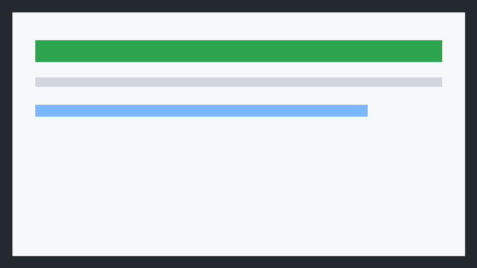
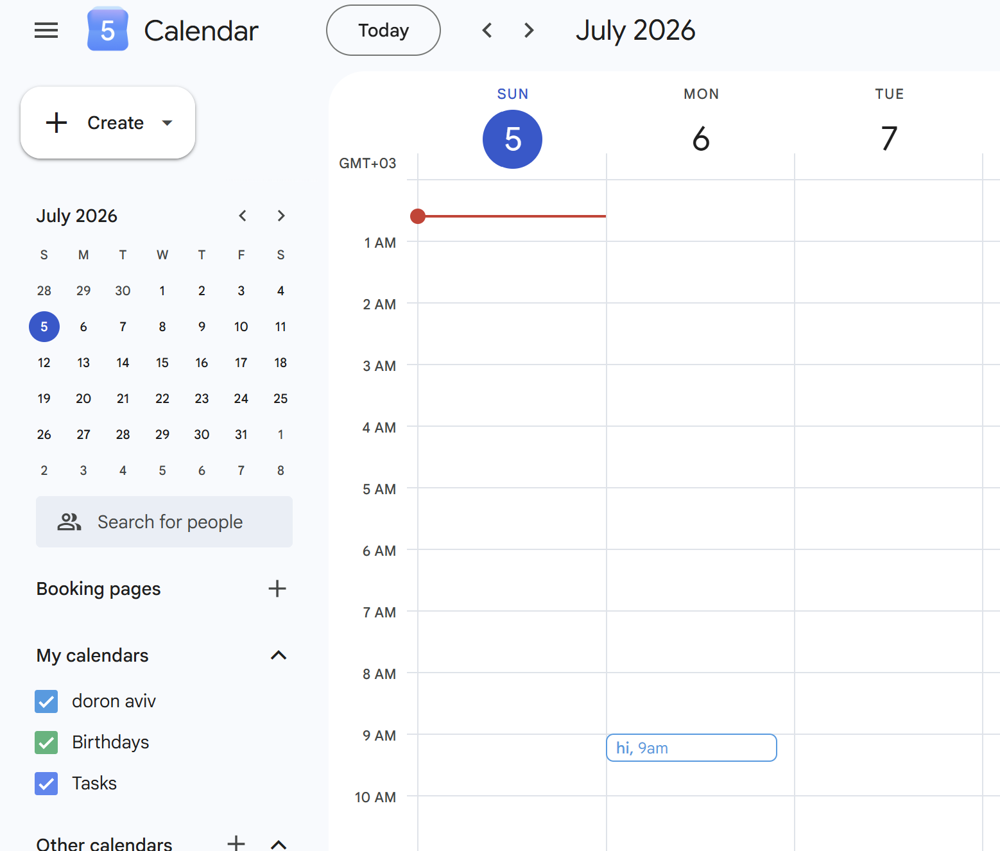

# Gmail AI Scheduling Agent

A Python agent that monitors Gmail for meeting requests, uses an LLM to turn email text into structured scheduling intent, checks Google Calendar availability, and either books the meeting or replies with a conflict message.




## What It Does

The agent is designed for a single Google Workspace user. It polls Gmail for unread messages, identifies likely meeting requests, parses requested dates, times, durations, attendee details, and intent, then checks the user's primary Google Calendar. If a requested slot is available, it creates a calendar event and optionally replies to the sender. If the requested slot is busy, it replies with a concise conflict message. When an email asks for a day but not a specific time, the agent searches working hours for the first available slot.

## Architecture

The codebase is split into small modules:

- `scheduling_agent.auth`: OAuth authentication for Gmail and Calendar.
- `scheduling_agent.gmail_client`: Gmail search, message parsing, and replies.
- `scheduling_agent.calendar_client`: Free/busy lookup and event creation.
- `scheduling_agent.llm_parser`: LLM-backed parsing with a deterministic fallback.
- `scheduling_agent.scheduler`: Availability decisions and slot selection.
- `scheduling_agent.skill`: Reusable AI skill wrapper for parse-and-schedule decisions.
- `scheduling_agent.agent`: Main orchestration loop.
- `scheduling_agent.cli`: Command-line entry point.

The agent intentionally keeps Google credentials and user tokens outside Git. Use `.env` for local configuration and keep `credentials.json` and `token.json` on your workstation only.

## Repository Layout

```text
.
├── PRD.md
├── Plan.md
├── TODO.md
├── README.md
├── requirements.txt
├── .env.example
├── .gitignore
├── scheduling_agent/
├── tests/
├── tools/
└── screenshots/
```

## Setup

1. Create a Google Cloud project.
2. Enable the Gmail API and Google Calendar API.
3. Configure an OAuth consent screen.
4. Create an OAuth Desktop Client and download it as `credentials.json`.
5. Place `credentials.json` in the repository root, but do not commit it.
6. Create a virtual environment and install dependencies:

```bash
python3 -m venv .venv
source .venv/bin/activate
pip install -r requirements.txt
```

7. Copy the environment template:

```bash
cp .env.example .env
```

8. Set `OPENAI_API_KEY` if you want LLM parsing. Without it, the agent uses a deterministic parser that is useful for tests and simple emails.

## Configuration

`.env.example` documents every supported setting. The most important values are:

```bash
OPENAI_API_KEY=
OPENAI_MODEL=gpt-4.1-mini
GOOGLE_CREDENTIALS_FILE=credentials.json
GOOGLE_TOKEN_FILE=token.json
WORKDAY_START=09:00
WORKDAY_END=17:00
DEFAULT_MEETING_DURATION_MINUTES=30
POLL_INTERVAL_SECONDS=60
DRY_RUN=true
```

Keep `DRY_RUN=true` until you have verified the agent behavior. In dry-run mode the agent logs intended event creation and replies without mutating Gmail or Calendar.

## Running

Authenticate and run one polling pass:

```bash
python -m scheduling_agent.cli run-once
```

Run continuously:

```bash
python -m scheduling_agent.cli watch
```

Inspect configuration:

```bash
python -m scheduling_agent.cli config
```

## Gmail Query

By default the agent searches:

```text
is:unread newer_than:7d
```

You can override this with `GMAIL_QUERY` in `.env`. For production, start with a restrictive query such as:

```text
is:unread newer_than:2d ("meeting" OR "schedule" OR "call")
```

## Safety Model

The agent uses several safeguards:

- It ignores emails that do not parse as meeting requests.
- It defaults to `DRY_RUN=true`.
- It never commits `credentials.json`, `token.json`, `.env`, caches, virtual environments, or local database files.
- It logs decisions before taking external actions.
- It marks processed messages with a Gmail label to avoid duplicate handling.

## Tests

```bash
pytest
```

The test suite uses fake Gmail and Calendar clients, so it does not require Google credentials.

## Important Security Notes

Never commit:

- `.env`
- `credentials.json`
- `token.json`
- OAuth refresh tokens
- exported email data
- local logs with private email content

The `.gitignore` blocks those files by default.
